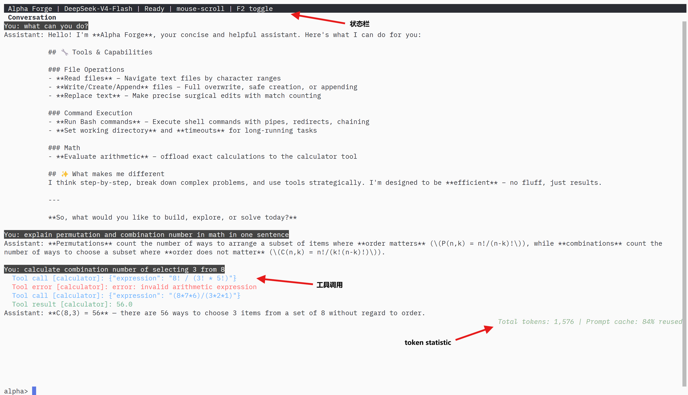

# alpha-forge

This project aims to implement an agent on top of the OpenAI SDK or the surrounding OpenAI ecosystem.

Project constraint:

- OpenAI is the default and intended provider path.
- Do not introduce SiliconFlow-specific API keys, base URLs, model names, or config as defaults.
- Use provider-specific settings only when they are strictly necessary, and keep them opt-in behind generic OpenAI-compatible overrides such as `OPENAI_BASE_URL`.

## Usage



### Prerequisites

- Python 3.14 or newer
- [`uv`](https://docs.astral.sh/uv/)
- An OpenAI API key

Clone the repository and install the project environment:

```sh
git clone https://github.com/zkaiwen5810/alpha-forge.git
cd alpha-forge
uv sync
```

Provide your API key in the environment. The model and timeout are optional;
their built-in defaults are `gpt-4.1-mini` and 30 seconds.

```sh
export OPENAI_API_KEY="sk-..."
# Optional:
export OPENAI_MODEL="gpt-4.1-mini"
export OPENAI_TIMEOUT="30"
```

Alternatively, generate a persistent user configuration and add the key to
the resulting TOML file:

```sh
uv run alpha-forge --init-config
# Edit ~/.config/alpha-forge/config.toml
```

API keys are intentionally not accepted as command-line arguments.

### Run from source

Start the terminal UI from the repository root:

```sh
uv run alpha-forge
```

Enter a prompt and press Enter. Alpha Forge can stream a response and use its
built-in calculator, file-reading, file-writing, and Bash tools when needed.
For example, this prompt gives the agent room to demonstrate a complete
inspect-and-verify workflow:

```text
Inspect this project, explain how it is structured, run its tests, and suggest
the three most valuable improvements. Cite the files that support your answer.
```

Useful commands inside the terminal UI:

- `/help` — show available commands
- `/model` — list available models
- `/clear` — start a new conversation
- `/resume PATH` — continue a saved transcript
- `/exit` or `/quit` — close Alpha Forge

For a one-off runtime override, pass a non-secret option after the executable:

```sh
uv run alpha-forge --model gpt-4.1-mini --timeout 60
```

Leave `OPENAI_BASE_URL` unset to use OpenAI directly. To intentionally route
the SDK through an OpenAI-compatible gateway such as LiteLLM, set the generic
base URL or use `--base-url`; see [LiteLLM proxy](#litellm-proxy).

## Architecture

The application is built around the OpenAI SDK and the OpenAI API shape.

Default path:

- App code uses the OpenAI SDK directly.
- `OPENAI_API_KEY` is required.
- `OPENAI_MODEL` defaults to an OpenAI model such as `gpt-4.1-mini`.
- `OPENAI_BASE_URL` stays unset, so requests go to OpenAI directly.

Gateway path:

- The devcontainer also runs a local LiteLLM gateway.
- App code can point the same OpenAI SDK client at LiteLLM by setting `OPENAI_BASE_URL`.
- LiteLLM acts as an OpenAI-compatible gateway in front of the upstream provider.
- This keeps application code OpenAI-shaped even when traffic is routed through a proxy.

Design intent:

- OpenAI remains the primary and documented provider path.
- LiteLLM is part of the local and deployment architecture when a gateway is useful.
- Non-OpenAI providers must remain opt-in and should be introduced through generic OpenAI-compatible settings, not provider-specific defaults in app code.

### Tool calling

Tool definitions and execution are isolated in `alpha_forge.tools`.
`ToolRegistry` stores provider-neutral `ToolSpec` values and dispatches calls;
OpenAI schema generation belongs only to the OpenAI provider adapter.
`load_builtin_tools()` creates the default registry.

The default registry includes a safe `calculator` tool, a bounded UTF-8
`file_reader`, a UTF-8 `file_writer`, and a non-interactive `bash` tool. The file
reader accepts a zero-based character `offset` and bounded `limit`, then reports
`next_offset` and `eof` so a large file can be consumed without overflowing the
tool-result budget. The writer supports whole-file `write`, exclusive `create`,
`append`, and guarded exact-text `replace` operations. The Bash tool accepts a
required `cmd`, an optional working-directory `cwd`, and an optional timeout
from 0.1 through 300 seconds (30 seconds by default). It captures stdout and
stderr separately; nonzero exits and timeouts become failed tool results with
their diagnostics preserved.

Each Bash call runs in a fresh process through `bash --noprofile --norc -c`, so
shell state does not persist between calls. The child environment inherits
ordinary process settings but removes `BASH_ENV`, `ENV`, and underscore-delimited
environment-name components commonly used for secrets, including `KEY`,
`TOKEN`, `SECRET`, `PASSWORD`, `PASSWD`, and `CREDENTIALS`. This filtering is
also applied to singular `CREDENTIAL`. It is defense in depth, not a sandbox:
Bash commands retain the Alpha Forge process user's filesystem and network
permissions and can read any accessible files.

The stateless `QueryEngine` uses an effect/feedback protocol. Before each
provider request it asks the coordinator for a freshly projected committed
context. Model outputs and individual tool results also require durable commit
feedback before the loop can advance. The engine retains no session,
transcript, or mutable completed-history copy and stops after 10 intermediate
rounds before a final response.

The default serial context policy bounds one projected tool result to 16,000
Unicode characters and the latest tool exchange to 32,000 characters in
aggregate. It appends `context.edited` only when the projection actually
changes. Raw results remain intact in the transcript; oversized results are
reconstructed as deterministic, self-identifying head/tail previews containing
a stable result event reference.
The default layout is:

```text
$XDG_DATA_HOME/alpha-forge/transcripts/<session-id>.jsonl
```

When `XDG_DATA_HOME` is unset, the base directory is
`~/.local/share/alpha-forge`. A new transcript file is deferred until the
session accepts its first prompt or slash command; closing an unused session
leaves no file. At first input, the opening records and accepted input are
written together. Later records are appended, flushed, and synced before they
become visible as completed history. New transcript directories and files use
modes `0700` and `0600`.

`/resume PATH` validates and opens a transcript without changing it. If the
latest provider output has missing tool results, resumed query continuation
first persists one `interrupted` result per absent call; it never reruns a call
whose side effect may already have happened. Context preparation runs only
after the exchange is complete. The session-aware `tool_result_reader` pages
raw results by `result_event_id`. `/resume` and `/clear` share the input FIFO,
so they select the session used by later queued inputs.

To build a controller with a custom registry:

```python
from alpha_forge.application import ApplicationCoordinator
from alpha_forge.tools import Tool, ToolRegistry

registry = ToolRegistry([
    Tool(
        name="greet",
        aliases=("hello",),
        display_description="Returns a greeting for a person.",
        description="Use this to create a greeting for a named person.",
        input_schema={
            "type": "object",
            "properties": {"name": {"type": "string"}},
            "required": ["name"],
            "additionalProperties": False,
        },
        handler=lambda arguments: f"Hello, {arguments['name']}!",
    )
])
coordinator = ApplicationCoordinator(config, tool_registry=registry)
```

### Transcript and history projections

See [the transcript architecture](docs/transcript-architecture.md) for the
event catalog, context operations, recovery boundary, and persistence flow.

`alpha_forge.transcript` owns a completely new schema-v1 append-only JSONL
ledger. Its durable events are `session.opened`, `session.linked`,
`input.accepted`, `command.completed`, `model.output`, `tool.result`,
`context.edited`, and `query.failed`. A `ModelOutput` atomically contains the
ordered provider output items and all requested `ToolCall` values; tool results
are appended individually as calls finish. Records from other schema versions
are rejected.

The ledger is linear. There are no turns, branches, parent event chains, or
created-time visibility rules. Query protocol follows sequence order:
`input.accepted` opens a prompt, intermediate model outputs request tools, and
a model output without tools or `query.failed` closes it.

Provider and UI projectors independently derive normalized values directly
from committed records. The model projector applies context operations; the UI
projector continues to show raw history. `SetToolResultRepresentation` selects
a deterministic raw or preview form. `SetToolExchangeVisibility` can exclude
or restore a whole completed intermediate tool exchange by model-output event
ID. The visibility type is present for future compaction, but no automatic
visibility policy is enabled; a future policy must use measured context
occupation rather than event age.

All prompts and slash commands use one in-memory FIFO. Waiting items are
intentionally not durable. A dequeued item is written to the then-current
session before handling, allowing `/clear` and `/resume` to deterministically
select the session for later items.

Partial output text, reasoning, refusals, usage, and tool-call arguments are
UI-owned ephemeral state. A completed model output is committed before any tool
starts, and each tool result is committed before the next call. Every commit
publishes a new immutable session view. A WAL failure stops provider/tool
progress and later input processing so the application cannot continue from
state that was never durable.

## Local secrets

Store devcontainer startup secrets in host-side env files under `.devcontainer/`. Docker Compose injects each file into the service that needs it.

1. Copy `.devcontainer/app.env.example` to `.devcontainer/app.env`
2. Copy `.devcontainer/litellm.env.example` to `.devcontainer/litellm.env`
3. Copy `.devcontainer/cf-r2.env.example` to `.devcontainer/cf-r2.env`
4. Replace placeholder values with your real local secrets
5. Recreate the devcontainer after changing any env file
6. Open an example script in Zed
7. Run it with a Zed task or from the built-in terminal

`app.env` example:

```env
OPENAI_API_KEY=sk-your-local-litellm-master-key
OPENAI_MODEL=gpt-4.1-mini
OPENAI_BASE_URL=http://litellm:4000/v1
OPENAI_TIMEOUT=30
```

`litellm.env` example:

```env
OPENAI_API_KEY=your-real-openai-key
LITELLM_MASTER_KEY=sk-your-local-litellm-master-key
LITELLM_SALT_KEY=your-local-litellm-salt-key
```

`cf-r2.env` example:

```env
CF_R2_ACCESS_KEY_ID=your-cf-r2-access-key-id
CF_R2_SECRET_ACCESS_KEY=your-cf-r2-secret-access-key
CF_R2_BUCKET_NAME=litellm-logs
CF_R2_REGION=us-east-1
CF_R2_ENDPOINT_URL=your-cf-r2-endpoint-url
```

Read values in Python with `os.getenv("OPENAI_API_KEY")`.

Optional override:

Set `OPENAI_BASE_URL` in `.devcontainer/litellm.env` only when you intentionally want LiteLLM itself to call a non-default OpenAI-compatible provider.

Leave `OPENAI_BASE_URL` unset for the normal OpenAI API path. Only set it when you intentionally want to target an OpenAI-compatible non-default provider.

In the devcontainer, environment variables come from the host-side `.devcontainer/app.env`, `.devcontainer/litellm.env`, and `.devcontainer/cf-r2.env` files. Because the workspace is mounted as a Docker volume, do not use a repo-root `.env.local` as the devcontainer source of truth.

Avoid setting a placeholder `GITHUB_TOKEN` in `.devcontainer/app.env`. Zed may pass that variable through when downloading language server binaries such as Ruff, and an invalid token causes GitHub API `401 Bad credentials` failures.

Env file changes are runtime configuration. Restart or reopen the devcontainer to make new values effective; rebuilding the image is not required unless Dockerfile or image inputs changed.

## Configuration

The CLI resolves configuration from three layers, highest priority first:

1. **CLI flags** — `--model`, `--base-url`, `--timeout`, and `--init-config` (one-shot).
2. **User config file** — a TOML file at the XDG path `~/.config/alpha-forge/config.toml` (honors `$XDG_CONFIG_HOME`).
3. **Environment variables** — `OPENAI_API_KEY`, `OPENAI_MODEL`, `OPENAI_BASE_URL`, `OPENAI_TIMEOUT`. A repo-root `.env` file is also loaded.

If no layer provides an `api_key`, the CLI exits with a hint pointing at the user config file. Run `alpha-forge --init-config` to write a commented template you can edit.

### User config file

The user config file is the recommended place for persistent personal settings (your API key, your preferred model, your LiteLLM base URL). Generate it once and edit it in place:

```sh
alpha-forge --init-config
# then edit ~/.config/alpha-forge/config.toml
```

Format — one `[openai]` table, only the keys you need:

```toml
[openai]
api_key = "sk-..."
model = "gpt-4.1-mini"
base_url = "https://api.openai.com/v1"
timeout = 30
```

Unknown top-level keys are ignored for forward compatibility. A malformed file is a hard error — the CLI will not silently fall through to env vars. API keys are never accepted on the command line; use the file or an env var.

### CLI flags

```sh
alpha-forge --model gpt-4o
alpha-forge --base-url http://localhost:4000/v1
alpha-forge --timeout 60
alpha-forge --init-config
```

The CLI flags override the user file, which overrides env vars. The built-in
defaults are `gpt-4.1-mini` for `model` and 30 seconds for `timeout`.

### Environment variables

The env var layer is the lowest-priority source. It is also the easiest way to script the CLI in CI or in shell aliases without touching a config file:

```env
OPENAI_API_KEY=sk-...
OPENAI_MODEL=gpt-4.1-mini
OPENAI_BASE_URL=https://api.openai.com/v1
OPENAI_TIMEOUT=30
```

`.env` files in the working directory are loaded via `python-dotenv` (existing var values are not overridden).

## LiteLLM proxy

The devcontainer starts a LiteLLM proxy next to the main app container with Docker Compose. The proxy is available at `http://localhost:4000` from the host.

When enabled, LiteLLM is a gateway layer in the architecture:

- Inside the app, code still uses the OpenAI SDK.
- The gateway is selected by setting `OPENAI_BASE_URL`.
- LiteLLM then forwards requests either to OpenAI or to another OpenAI-compatible upstream configured on the gateway side.
- Some OpenAI features may require extra LiteLLM configuration to behave the same way through the gateway.
- Responses API session continuity is backed by Cloudflare R2 through LiteLLM cold storage.

Local infrastructure for the gateway:

- LiteLLM API: `http://localhost:4000`

Cloudflare R2 is used as the S3-compatible cold-storage backend. LiteLLM persists prompt and response content there so `previous_response_id` can restore prior conversation state.

To route app code through LiteLLM from inside the devcontainer, set this in `.devcontainer/app.env`:

```env
OPENAI_BASE_URL=http://litellm:4000/v1
```

To route host-side tools through LiteLLM, use:

```env
OPENAI_BASE_URL=http://localhost:4000/v1
```

Leave `OPENAI_BASE_URL` unset for the normal OpenAI API path.

Install the project environment first:

```sh
uv sync
```

Zed note:

Zed's Python REPL cell execution is currently not supported in devcontainers using `docker exec`, so these examples are set up as normal Python scripts and should be run with Zed tasks or the terminal instead of `# %%` cells.

Current shell session:

```sh
zed .
```

Run the examples from Zed:

1. Open the command palette
2. Run `task: spawn`
3. Choose `Run current Python file with uv`, `Run chat example`, or `Run tool function example`

You can also run the examples directly from a terminal:

```sh
uv run python examples/chat.py
uv run python examples/tool_function.py
```

Available examples:

- `examples/chat.py`
- `examples/tool_function.py`

These examples are OpenAI-first:

- They require `OPENAI_API_KEY`.
- They default to `OPENAI_MODEL=gpt-4.1-mini`.
- They only use `OPENAI_BASE_URL` if you explicitly set it.

`.devcontainer/app.env`, `.devcontainer/litellm.env`, and `.devcontainer/cf-r2.env` should stay git-ignored. Keep real secrets out of committed files and use your deployment platform's secret manager in non-local environments.
