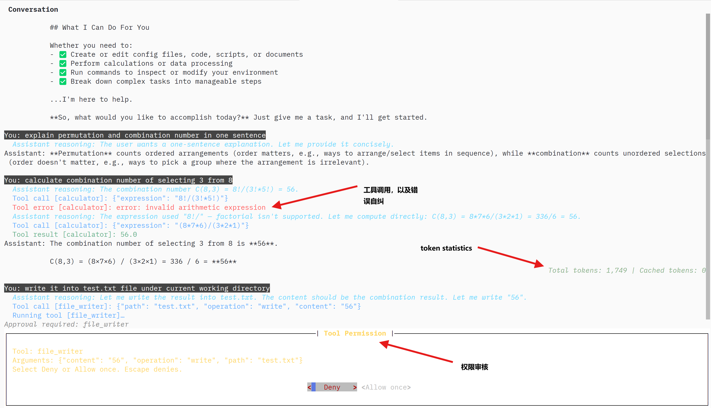

# Alpha Forge

Alpha Forge is a terminal AI agent built on the OpenAI Python SDK. Chat with it
to explore a codebase, edit files, run commands, and work through tasks across
saved conversations.



## Core features

### Interactive terminal

- **Streaming chat:** Follow responses, tool calls, results, and token usage in
  a scrollable conversation view.
- **Queued prompts:** Submit follow-up prompts while the agent is working;
  inputs run in the order you submit them.
- **Command shortcuts:** Use slash-command suggestions and input history.
  `/help` shows commands, `/model` lists available models, and `/exit` or
  `/quit` closes the app.

### Local tools and approvals

- **Read files:** Inspect UTF-8 text files in chunks, including files too large
  to read in one request.
- **Edit files:** Create, overwrite, append to, or make exact-text replacements
  in files, with match-count checks for replacements.
- **Run Bash:** Execute non-interactive commands with a working directory and
  timeout; return stdout, stderr, and exit status to the agent.
- **Calculate:** Evaluate basic arithmetic with a dedicated calculator tool.
- **Approve changes:** Each Bash command and file write requires approval in
  the terminal. File reads and calculations run automatically. Tool arguments
  are validated against their schemas before execution.

### Sessions and large results

- **Saved conversations:** Automatically persist accepted inputs, completed
  model outputs, and tool results in local JSONL transcripts under
  `~/.local/share/alpha-forge/transcripts/` (honoring `$XDG_DATA_HOME`).
- **Resume or start fresh:** Use `/resume PATH` to restore a saved conversation
  or `/clear` to start a new one. Resume marks unfinished work as interrupted
  and waits for your next message; it makes no model requests or tool calls.
  Send a message such as “continue” to start a fresh query with the saved context.
  Missing tool results have unknown execution outcomes, since actions may have
  happened before their results were saved.
- **Bounded tool output:** Large results become compact previews in the model's
  context while the full results remain stored. The agent can retrieve more
  through the built-in `tool_result_reader` tool.

### Configuration and extension

- **OpenAI by default:** Use OpenAI directly, or opt into an OpenAI-compatible
  gateway such as LiteLLM through `OPENAI_BASE_URL` or `--base-url`.
- **Layered settings:** Configure the model, endpoint, and request timeout with
  CLI flags, a user TOML file, or environment variables, in that priority order,
  followed by built-in defaults. API keys come only from the config file or
  environment variables.
- **Custom behavior:** Python integrations can register tools and hooks that
  run before tool execution, or supply context policies. See the
  [session and context architecture](docs/transcript-architecture.md) and
  [terminal UI architecture](docs/ui-architecture.md) for implementation details.

## Getting started

### Prerequisites

- Python 3.14 or newer and [uv](https://docs.astral.sh/uv/).
- An OpenAI API key.
- Bash on `PATH` to use the command-execution tool.

### Install and configure

```sh
git clone https://github.com/zkaiwen5810/alpha-forge.git
cd alpha-forge
uv sync
uv run alpha-forge --init-config
```

Edit `~/.config/alpha-forge/config.toml` (or
`$XDG_CONFIG_HOME/alpha-forge/config.toml`):

```toml
[openai]
api_key = "sk-your-openai-api-key"
```

Alternatively, set `OPENAI_API_KEY` in your environment. Optional environment
settings are `OPENAI_MODEL`, `OPENAI_TIMEOUT`, and `OPENAI_BASE_URL`; a local
`.env` file is also loaded. The built-in model is `gpt-4.1-mini` and the request
timeout is 30 seconds. Leave the base URL unset to use OpenAI directly.

### Run and try a task

```sh
uv run alpha-forge
# Optional overrides for this run:
uv run alpha-forge --model gpt-4.1-mini --timeout 60
```

Type a prompt and press Enter, for example:

```text
Read pyproject.toml and summarize this project's dependencies.
```

Then try a follow-up that uses file editing:

```text
Create dependency-summary.md with that summary.
```

Review the requested file write in the approval dialog and allow or deny it.
