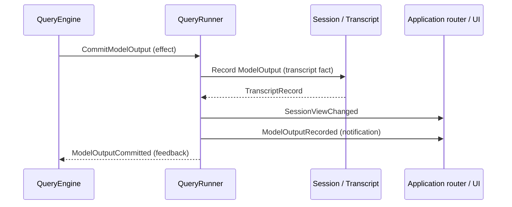

# Transcript, context, and query architecture

Alpha Forge uses one linear schema-v1 transcript as the durable authority for
both provider context and UI history. Completed model-facing contents are not
stored in a second history list. Projectors normalize the ledger independently
for each consumer.

## Package boundaries

- `providers` owns provider-neutral completed output and stream values.
  `OpenAIChatAdapter` is the default adapter and is the only layer that
  translates these values to OpenAI Chat Completions dictionaries.
- `transcript` owns the schema-v1 event catalog, strict codec, protocol replay
  validation, and exclusive JSONL writer.
- `projectors` derives provider context and flat UI facts from
  committed transcript records.
- `context` owns immutable provider-context values and ordered context-edit
  policies. It does not execute tools or call a provider.
- `query` owns the stateless multi-request provider/tool loop. It requests
  context and durable commits through an effect/feedback protocol.
- `tools` owns provider-neutral tool specifications, lookup, and execution.
- `sessions` is the application transcript-write boundary. It exposes
  commands and projections, not a mutable message list.
- `application` coordinates the FIFO, session switching, query execution,
  tool permissions, and reactive presentation events through dedicated services.
- `ui` owns terminal presentation. History, input, and permission components
  each own their state and widgets; the terminal shell composes them.

The dependency direction is toward small value and protocol modules. The query
engine has no transcript, session, command, coordinator, or UI reference.

## Application and terminal components

Start with `cli.run_repl_async`: it creates an `ApplicationCoordinator` and a
`TerminalChatUi`, then runs the FIFO consumer alongside the terminal application.

| Component | Owns | Collaborates through |
| --- | --- | --- |
| `ApplicationCoordinator` | Input acceptance, FIFO, session activation, slash commands, session switching, failure handling, shutdown | `Session`, `QueryRunner`, `PermissionBroker`, application events |
| `QueryRunner` | Session-specific query requests, effect/feedback iteration, context preparation, durable effects, progress publication | An explicit session for each request/run; no retained current session |
| `PermissionBroker` | One pending approval future and resolution exactly once | Application permission events and the coordinator's request/resolve methods |
| `Session` | Transcript commands, projections, creation, resume, and closing | Transcript storage and projectors |
| `ToolResultReader` | Raw-result paging and its tool definition | The transcript selected for the current query |
| `TerminalChatUi` | Application lifetime, styles, global actions, status-bar formatting, coordinator integration | History and bottom-area interfaces |
| `HistoryArea` | Conversation region and navigation | History control/state and upward change notifications |
| `BottomArea` | Queue, input/permission visibility, status, focus routing | Child widget interfaces, action callbacks, and change notifications |

The terminal shell composes a fixed status bar and two major areas. It forwards
application events to the areas and reacts to their change notifications with
redraw requests. Only the terminal subscribes to or invokes the coordinator.
Children communicate with their immediate parent through action callbacks and
widget change notifications. These are separate from awaited tool execution hooks.

The bottom area owns the visibility relationship between permissions and the
input panel. Suggestions are part of the input panel; queued inputs are a
separate widget. Status is computed in the bottom area and exposed to the top
bar through a read-only property. The terminal does not inspect grandchildren.

See [the UI architecture guide](ui-architecture.md) for the widget protocol,
state ownership, focus and keyboard behavior, and examples of how updates and
actions travel through the layers.

Committed history comes from `SessionView`; provider deltas and running tools
remain ephemeral. `HistoryState` invalidates its committed-line cache on every
new view, including a different session with the same revision. The history
control wraps those lines for the viewport, while clipboard copying uses only
unwrapped committed transcript text. UI tool-result previews retain the final
20 lines and do not alter model context or stored results.

A query runner receives the selected session explicitly. Its tool registry is a
copy with a `ToolResultReader` bound to that session's transcript, unless a caller
already supplied a tool with that name. Model-output and tool-result effects
append through `Session`, publish the committed view and application notification,
then return feedback to the query engine. Context preparation publishes a new
view only when a policy commits an edit. The coordinator handles failures and
owns session lifetime.
This keeps `/clear` and `/resume` from leaving a reader or query attached to the
previous session.

The coordinator always installs the default permission hook for `bash` and
`file_writer`, including when constructed programmatically. Additional hooks
can be registered through `coordinator.hook_registry`; callers must resolve approval
requests when executing a tool covered by the default hook.

## Record envelope

Every JSONL line is one record:

```json
{
  "schema_version": 1,
  "sequence": 0,
  "event_id": "stable-unique-id",
  "recorded_at": "2026-07-27T12:00:00Z",
  "type": "session.opened",
  "payload": {}
}
```

`sequence` starts at zero and is contiguous. Event IDs are unique. Timestamps
are audit metadata only; protocol order and context visibility never depend on
wall-clock time. This is a completely new schema: records with any schema
version other than 1 are rejected and no legacy migration is attempted.

A new session starts as provisional in-memory state: `session.opened` and a
possible `/clear` link are buffered without creating a file. When the session
accepts its first prompt or slash command, the writer creates and locks the
file, writes the buffered records together with `input.accepted`, and flushes
them with `fsync`. Closing a provisional session leaves no transcript file.

After that first input, the writer validates each candidate against replay
state, writes one compact line, flushes it with `fsync`, and only then exposes
the new revision to in-process readers. It holds an exclusive file lock. A
stale expected revision, invalid protocol transition, or write failure cannot
publish a partial in-memory state. An incomplete final JSONL fragment can be
removed during resume; a malformed completed line makes the transcript
corrupt.

## Durable event catalog

| Type | Atomic payload and responsibility |
| --- | --- |
| `session.opened` | Session ID and optional instructions; exactly one at sequence 0 |
| `session.linked` | `/clear` or `/resume` link to a source session and command event |
| `input.accepted` | Prompt text, or raw command plus parsed name and arguments |
| `command.completed` | One command status and its ordered visible messages |
| `model.output` | One provider response: ordered output items, finish reason, and usage |
| `tool.result` | One raw result for one call, appended immediately after that call |
| `context.edited` | One policy invocation and an atomic list of declarative operations |
| `query.failed` | Terminal prompt failure with a classified stage and message |

Provider transport chunks, request-start markers, tool-start markers, queue
state, view changes, and commit acknowledgements are ephemeral application
events. They are not required to reconstruct model or UI history.

`model.output` remains atomic because one provider response may request
multiple tools. Its output items use provider-oriented names:

- `OutputMessage`, containing `OutputText` and/or `OutputRefusal`
- `ReasoningItem`
- `ToolCall`, identified by `call_id`

Tool calls are not flattened into separate transcript records. Tool results
are flat because calls execute sequentially and each completed result must be
durable before the next side effect begins. `ToolResult.call_id` supplies the
correlation; UI naming does not leak into the provider value model.

There are no turns, branches, turn IDs, or parent-event chains. A prompt opens
one query in ledger order. Model outputs and tool results extend that open
query until a model output without calls or a `query.failed` event closes it.
This is the smallest ordering model needed for the current sequential app.

## Context edits

A `context.edited` event records:

```text
policy = {name, version, parameters}
operations = [operation, ...]
```

The event exists only when at least one operation changes projected context.
The default policy therefore emits no event when every tool result already
fits its limits.

Schema v1 defines two operation types:

- `SetToolResultRepresentation(result_event_id, representation)` selects
  either the original result or deterministic version-1 head/tail preview
  metadata. Raw tool content is never copied into the edit event.
- `SetToolExchangeVisibility(model_output_event_id, visible)` excludes or
  restores an entire completed intermediate tool exchange—its tool-calling
  model output and correlated results—as one protocol-safe unit.

Operations target durable event IDs, so a future compaction policy can hide an
intermediate provider output from a query days earlier without knowing a turn
number or rewriting historical records. Replay folds later operations over the
same target. An edit cannot target an unknown result/output, repeat a slot in
one event, be a no-op, hide an incomplete exchange, or hide the current query
tail.

`SetToolExchangeVisibility` is intentionally only a schema capability today.
No automatic visibility policy is installed. When one is added, its decision
must use measured context occupation (for example token or context-window
pressure), never record creation time or age.

Policies run serially at provider-request preparation. After a policy returns
operations, the coordinator durably appends them and reprojects before
evaluating the next policy. Consequently each policy sees the committed output
of all earlier policies.

## Event boundaries and vocabulary

Append transcript facts, handle query effects, return feedback, publish
application notifications, and await execution hooks. These operations have
different delivery and failure semantics:

| Contract | Owner and delivery | Meaning |
| --- | --- | --- |
| `TranscriptEvent` | `Session` appends through `TranscriptStore`; projectors read records | Stored semantic facts for replay and history |
| `QueryEffect` | Engine yields to `QueryRunner`; runner returns `QueryFeedback` through `asend` | Application work requested before the engine can continue |
| `QueryProgress` | Engine yields to `QueryRunner` without feedback | Ephemeral execution observations |
| `ApplicationEvent` | `ApplicationEventRouter` synchronously calls subscribers in registration order | Presentation notifications, including streaming and permission state |
| `HookContext` | `ToolExecutor` awaits matching `HookRegistry` actions in order | Validated interception context; a raised exception prevents invocation |

`QueryMessage` is the base for effects and progress; `QueryEmission` is the union
of concrete yielded messages. Neither belongs to the application event hierarchy.
The application router rejects other message families. Subscriber exceptions
propagate and stop the current delivery pass; this is synchronous notification,
not a background queue or an isolated observer service.

`QueryRunner` explicitly translates progress into application-owned types:

| Query progress | Application notification |
| --- | --- |
| `ProviderRequestStarted` | `ResponseStreamStarted` |
| `ProviderDeltaReceived` | `ResponseStreamUpdated` |
| `ProviderResponseCompleted` | `ResponseStreamCompleted` |
| `ToolCallProcessingStarted` | Application-owned `ToolCallProcessingStarted` |
| `QueryCompleted` | `StatusChanged("Ready")` |

Shared provider payload values are allowed, but message classes are distinct.
The runner rejects unsupported effects, progress, or messages instead of silently
discarding them. UI consumers subscribe to or handle only `ApplicationEvent`.

### Received, recorded, and acknowledged

`ResponseStreamCompleted` means the full response has arrived; it has not yet
been saved. The commit sequence is:



Tool results follow the same ordering. A failed append prevents the corresponding
view, success notification, and feedback, stopping subsequent query work.
Committed UI history comes from the projected view; streaming notifications
update only the ephemeral preview.

### Tool processing and approval

`ToolCallProcessingStarted` is emitted before argument validation and approval;
it does not establish that the tool handler has started. After validation, the
executor awaits `PreToolExecution` hooks. The permission action calls the
application's `PermissionBroker`, which translates this context into a
`ToolPermissionRequested` notification with `request_id`, `call_id`, `tool_name`,
and immutable `tool_input` fields, then awaits a decision future.

The UI calls `resolve_tool_permission(request_id, allowed)` to return the decision.
The broker resolves the future once and publishes `ToolPermissionResolved`.
Approval lets the awaited hook return; denial raises and prevents invocation.
The executor converts denial into an error tool result, which is then committed
normally. Neither the hook context nor the permission notifications are stored.

## Query effect and feedback flow

One accepted prompt follows this loop:

1. The query yields `PrepareContext`.
2. `QueryRunner` runs context policies, commits non-noop edits, projects the
   resulting transcript, and sends `ContextPrepared` feedback.
3. The query streams one provider request and emits progress, which the runner
   translates into application notifications for the UI.
4. The query yields `CommitModelOutput`; it cannot advance until the
   runner sends `ModelOutputCommitted` with the assigned event ID and
   committed revision.
5. If the output contains tool calls, calls execute sequentially. Each
   `CommitToolResult` similarly requires `ToolResultCommitted` feedback.
6. The loop returns to context preparation and may request the provider again.
   A response without calls completes the query.

The query engine never appends to a local completed-message list and never
applies a context edit itself. The context snapshot received as feedback is
the exact input to one provider request and is discarded before the next
iteration. This prevents transcript projection and a query-local copy from
diverging.

## Restoring history and interrupting abandoned work

`/resume PATH` restores a conversation and waits for user input. It never
continues an old query, calls the provider, or executes tools. Sending a new
message (including “continue”) starts a fresh query with the saved context
and a fresh intermediate-round budget.

`Session.resume()` opens and validates the transcript without appending semantic
events. The storage layer may still truncate an incomplete final JSONL fragment
left by a torn write. Opening a transcript for inspection does not close a query.

When the coordinator starts consuming input or prepares a destination session,
it calls `Session.interrupt_open_query()`. This idempotent operation uses the
transcript indexes to append an `interrupted` result for each missing tool call,
in provider order, then closes the abandoned prompt with
`query.failed(stage="interrupted")`. The UI displays:
“Previous request was interrupted. Send a message to continue.”

Existing results remain intact. A missing result has an unknown execution outcome:
a side effect may have happened before the result reached the WAL. Placeholders
record this uncertainty and complete the tool exchange for subsequent model
context; they do not execute or retry tools. Saved outputs and results remain
available to both model and UI projections.

Each finalization append is durable. If a crash interrupts finalization, the next
activation fills only the results still missing and appends the terminal event
once. Completed and already failed queries need no finalization writes.

A destination is finalized and linked before the coordinator switches sessions.
If preparation fails, its writer is closed and the source remains selected.
Failure during startup activation halts persistence and prevents queued queries
from running. The coordinator has a single input FIFO; the query engine receives
only a newly accepted prompt ID, tool specifications, and a tool executor.

## UI projection and responsiveness

Input submission only enqueues and publishes queue state. The single consumer
dequeues in FIFO order, appends `input.accepted`, then handles a command or
query. Every durable append is followed by a fresh immutable `SessionView`.
Provider deltas and running-tool state remain UI-owned ephemeral values.

The UI projector always renders raw transcript content, including exchanges
excluded from model context. The model projector applies representations and
exchange visibility. Thus UI display and provider context share one source of
truth while retaining consumer-specific filtering.
