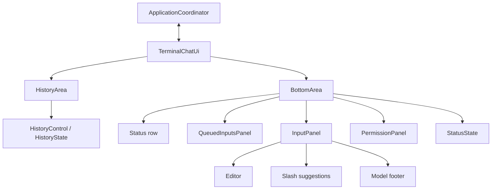

# Terminal UI architecture

Start with `cli.run_repl_async`, which creates the coordinator and
`TerminalChatUi`. The terminal is the only UI object that subscribes to the
coordinator's event router or calls its methods.

## Layout and ownership



The history area starts at the top and fills the available space, with its
Conversation heading above the scrolling history. Immediately below it, the
bottom area renders a status row, any queued prompts, and either the permission
dialog or the input panel. The input panel renders the editor followed by either
a muted `Model: {model}` footer or slash suggestions. The model footer,
suggestions, and permission dialog are mutually exclusive. Status and model
text each occupy one non-focusable row and clip to available width. Status uses
italic gray text; the queue has a bold gray heading and gray prompt text.

| Layer | Owns | Public capabilities used by its parent |
| --- | --- | --- |
| `TerminalChatUi` | Application lifetime, coordinator integration, styles, clipboard, terminal mouse support | `run_async()` |
| `HistoryArea` | Conversation region, history navigation bindings, history update notifications | Widget protocol, `handle()`, `key_bindings`, `transcript_text()` |
| `BottomArea` | Cross-widget visibility, interaction bindings, status rendering and feedback, routing child actions/focus | Widget protocol, `handle()`, `key_bindings`, `status_message`, `show_status_message()`, `focus_target` |
| `HistoryControl` / `HistoryState` | History viewport, wrapping, committed-line cache, streaming/tool previews | Used inside the history area |
| `QueuedInputsPanel` | Queue contents and titled queue display | Widget protocol, `handle()`, `pending_inputs` |
| `InputPanel` | Draft, input history, completion, editor, suggestions, model footer | Widget protocol, `focus_target`, `has_draft`, `complete_slash_command()` |
| `PermissionPanel` | Pending approval, bounded preview, buttons, request/resolution focus callbacks | Widget protocol, `handle()`, `focus_target`, `has_pending_request()`, `resolve()` |
| `StatusState` | Status messages and exit/persistence-failure flags | Used inside the bottom area |

`InputPanel` knows nothing about permissions or queued inputs. The bottom area
wraps the entire input panel in a `ConditionalContainer`, so hiding the editor
also hides suggestions and the model footer. The input panel's suggestions
condition depends only on the draft; the model footer uses its inverse. An
unmatched slash prefix still shows suggestions with "No matching commands."
Queue visibility is local to `QueuedInputsPanel`. The terminal passes the model
name as a string through the bottom area to the input panel.

There is one owner for each state value. The bottom area reads the queue count
when updating its status reducer and renders its own status row. The terminal
calls `bottom_area.show_status_message()` after copying the transcript; the
bottom area owns this feedback override and preserves its existing persistence
across subsequent status updates. The terminal does not inspect child controls.
Focus targets are opaque `UIControl` handles provided by widgets.

## Small widget interface

`UiComponent` in `alpha_forge.ui.component` is a structural protocol, not a base
class. Its two members are:

```python
on_change: WidgetEvent[UiComponent]

def __pt_container__(self) -> Container: ...
```

`WidgetEvent` is `prompt_toolkit.utils.Event`, distinguished from application
`ApplicationEvent` values. Construct it with the component as its sender. A parent subscribes
with `child.on_change += self._child_changed`. The callback receives the changed
component, not an application event or an action payload.

`__pt_container__` returns the component's existing root container. This lets
parents use components directly in `HSplit` and `ConditionalContainer`, without
accessing `.editor`, `.dialog`, or other grandchildren. This follows
[prompt-toolkit's documented widget composition interface](https://python-prompt-toolkit.readthedocs.io/en/stable/pages/full_screen_apps.html#the-layout).

Event-consuming components also implement `handle(event: ApplicationEvent) -> None`.
Leaf controls that do not consume application events need no empty handler.
State reducers may return a change flag internally; parents observe widgets
through `on_change` instead of aggregating those flags.

## Recognizing framework methods and our own methods

`HistoryControl` is the only class in this package that subclasses a
prompt-toolkit class. Its three inherited methods carry `@override`. The other
widgets use composition; they do not inherit from `UIControl` or `Container`.

| Mechanism | Methods or registration | Who calls it |
| --- | --- | --- |
| Inherited interface (`@override`) | `HistoryControl.create_content`, `is_focusable`, `mouse_handler` | Prompt-toolkit's rendering, focus, and mouse handling |
| Widget protocol (no inheritance required) | `__pt_container__` on each composite widget | Prompt-toolkit's `to_container()` discovers it by name |
| Explicit layout callback | `HistoryControl.vertical_scroll` passed as `Window(get_vertical_scroll=...)` | The window when determining its viewport |
| Explicit text callback | `PermissionPanel.render_request` passed as `Label(text=...)`; bottom status lambda passed to `FormattedTextControl` | Prompt-toolkit while generating display content |
| Explicit visibility predicate | `show_suggestions`, `has_pending_request`, `has_pending_inputs` passed to `Condition` | Prompt-toolkit when evaluating filters |
| Explicit input callback | `InputPanel.accept_input` passed as `TextArea(accept_handler=...)` | Buffer acceptance; True keeps text, False resets it |
| Framework event subscription | `_input_changed` added to `Buffer.on_text_changed` | The buffer's event dispatcher, passing the buffer as sender |
| Registered key handler | Functions decorated with `@bindings.add(...)` | Prompt-toolkit's key processor; `_key_bindings()` itself is our factory |
| Registered button handler | Lambdas passed as `Button(handler=...)` | The button when activated |
| Instance handler replacement | Editor control's `mouse_handler` assigned in `_disable_editor_scrolling` | Prompt-toolkit mouse dispatch, with non-wheel events delegated to the original handler |
| Application component API | `handle`, `on_change`, `focus_target`, `show_status_message` | Our parents and event routing; prompt-toolkit does not discover these names |
| Application lifecycle wrappers | `TerminalChatUi.run_async`, `exit` | Our CLI/event handling, delegating to the contained `Application` |

`UiComponent` is our structural typing protocol. Its `on_change` event uses
prompt-toolkit's `Event` utility, but subscribing to it and requesting a repaint
are our responsibilities. This differs from `Buffer.on_text_changed`, an event
provided and fired by the framework. Application events imported from
`alpha_forge.application.events` are a separate system again.

Callback method names such as `render_request` and `vertical_scroll` are ours;
they work because we pass them to framework parameters. Conversely,
`__pt_container__` must retain its recognized name. Do not add `@override` to
composition-based widgets just because they implement that protocol.

Ordinary helpers such as `render_pending`, `set_text`, and the state reducers
are called by our code. `create_content` builds all renderable history lines;
`Window` then applies the viewport and draws the visible portion. The mouse
handler returns `None` to consume an event or `NotImplemented` to let its window
try its fallback; this does not hand the event back to the terminal emulator.

## Downward updates, upward callbacks, and widget notifications

Application events take one path:

1. The coordinator, query runner, or permission broker publishes an
   `ApplicationEvent` through `ApplicationEventRouter`. Query progress and hook
   contexts are translated at these application boundaries.
2. The terminal forwards it to the history and bottom areas.
3. The history area updates its history control/state. The bottom area updates
   queue state, status, and then permission state, in that order.
4. Components update their own presentation and fire `on_change`. Composite
   widgets forward child notifications as their own change notification.
5. The terminal calls `Application.invalidate()` when running. Prompt-toolkit
   renders the current state on its next redraw.

A notification only requests a repaint. It must not redistribute application
events, call `handle()` again, or synchronously render a partially updated tree.
Multiple notifications during one event are safe: the final repaint reads the
completed updates through the existing dynamic text and visibility callbacks.

Actions use explicit callbacks wired by the immediate parent:

- Input submission travels from input panel to bottom area to terminal, which
  calls `coordinator.submit()`.
- Approval/denial travels from permission panel through the same parent chain.
  Clicking a button does not clear the request; the coordinator's resolution
  event does that.
- Permission focus callbacks go through the bottom area to the terminal's
  `Layout.focus()` call. Status and request state are updated before focus changes.
  New requests focus Deny; resolution events restore editor focus without
  modifying the draft. Existing cleanup behavior for failure/result events is
  preserved.

No child receives the coordinator, the application, or a sibling reference.
The bottom area coordinates its children through their public capabilities.
The history area's existing low-level control remains responsible for scrolling;
there is no new scrolling implementation or UI event bus.

## Key bindings

The history area defines Page Up/Down. The bottom area defines Tab completion,
Escape denial, and Ctrl-D with the empty-draft check. The terminal defines Ctrl-C
and F3, and consumes positionless wheel keys without taking action.

The terminal uses `merge_key_bindings()` to install all three groups at the
application boundary. Ownership is local, but availability remains global as
before. This matters when history or suggestions have focus and when the
permission dialog is modal: moving these bindings onto parent containers would
change which shortcuts work inside the dialog.

This follows the documented recommendation to
[merge independently defined binding groups](https://python-prompt-toolkit.readthedocs.io/en/stable/pages/advanced_topics/key_bindings.html#merging-key-bindings).
Conditional bindings still prevent Tab completion during approval and enable
Escape denial only while approval is pending. The dialog retains its built-in
button navigation.

## Mouse routing and native selection

Mouse support is always enabled. Prompt-toolkit routes positioned mouse reports
using the pointer's screen coordinates, independently of keyboard focus. History
handles wheel events in its own control. The editor consumes wheel events by
returning `None` before the containing Window can scroll; other editor mouse
events retain their normal handling. Suggestions and queued inputs use their
own windows' native scrolling. No scroll callback crosses component boundaries.

`Keys.ScrollUp` and `Keys.ScrollDown` are different: they have no pointer
coordinates. The terminal explicitly consumes them because prompt-toolkit's
fallback turns them into Up/Down keys, which would recall previous inputs.
Actual Up/Down keys still navigate input history; Page Up/Down navigate the
conversation. A terminal that sends wheel input as literal arrow keys cannot be
distinguished from keyboard arrows.

Text selection belongs to the terminal emulator, so there is no F2 mode or
application selection state. Hold the terminal's selection modifier while
dragging, then use its normal copy command:

- [Zed terminal](https://github.com/zed-industries/zed/blob/bebe92f469834a287f5a57ed78e8d51a918b8ada/crates/terminal/src/terminal.rs#L2400):
  hold Shift before pressing the left mouse button and throughout the drag.
- [VS Code terminal](https://code.visualstudio.com/docs/terminal/basics#_mouse-events-mode):
  Alt on Windows/Linux; Option on macOS with
  `terminal.integrated.macOptionClickForcesSelection` enabled.
- [Windows Terminal](https://learn.microsoft.com/en-us/windows/terminal/selection):
  Shift while selecting when the application has mouse support enabled.
- Other terminals: use their documented modifier for bypassing mouse reporting.

Native selection works on terminal-rendered text. It is not restricted to the
history region or aware of the application's full transcript; redraws and
selection persistence are controlled by the terminal. Returning `NotImplemented`
from a UI mouse handler does not restore native selection: the terminal has
already sent the event to the application. F3 still copies the entire committed
transcript through OSC 52, excluding live drafts.

## Extending and testing a component

Add a new widget to its immediate parent's container. Keep its state and
presentation together, expose `__pt_container__` and `on_change`, and subscribe
from the parent. Add `handle()` only if it consumes application events. Wire
specific action callbacks upward; do not make the terminal inspect the widget's
internal state. Cross-widget visibility belongs to their common parent.

`tests/test_ui_layers.py` exercises bottom-area visibility, notifications,
focus ordering, and actions without a coordinator. Terminal integration tests
exercise event routing, clipboard, scrolling, and keyboard dispatch, including
modal focus. `tests/test_ui_layout.py` compares rendered rows and window geometry
against eight snapshots covering status placement and the mutually exclusive
model footer, suggestions, and permission dialog at two terminal sizes. Native modifier-drag selection requires a manual check
in a real terminal because the terminal owns that interaction. The full
application/query tests continue to cover persistence and coordinator behavior.
